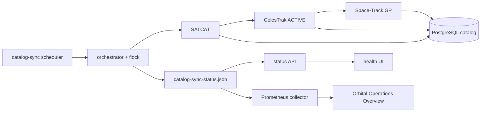

# v0.4F.1 — Automated Catalog & Ephemeris Synchronization

## 1. Scope

v0.4F.1 automates the catalog and ephemeris maintenance path that was
previously operated through individual ingestion commands. It provides:

- SATCAT metadata synchronization;
- CelesTrak `ACTIVE` GP ingestion;
- Space-Track current GP ingestion;
- independent scheduling for each source;
- persistent execution state;
- per-source retry and exponential backoff;
- bounded Prometheus telemetry;
- the read-only `GET /catalog/sync-status` API;
- catalog synchronization freshness in the operations health UI;
- catalog synchronization panels in Grafana.

This feature does not change Cesium rendering, the globe, night lights,
canonical ephemeris selection, conjunction analysis or playback. Provider
synchronization updates the inputs used by those systems; it does not change
their selection or numerical semantics.

## 2. Architecture

The `catalog-sync` service runs the scheduler. On each loop the scheduler reads
the persisted state, determines which sources are due and invokes the
orchestrator once with that ordered source set.



The canonical multi-source order is:

1. SATCAT;
2. CelesTrak;
3. Space-Track.

The manual CLI can request one source or `all`. A failure is recorded as an
error outcome for that source and does not prevent later requested sources from
running. The scheduler performs one orchestrator call per cycle rather than
starting an independent loop per provider.

Status and Prometheus consumers read the JSON state snapshot. They do not call
providers or query PostgreSQL. In Compose, the API and worker mount the same
host `data` directory at `/app/data`, so they see the same state and lock files.

## 3. Source responsibilities

### SATCAT

SATCAT is the catalog-metadata path. It creates or updates objects by NORAD
catalog ID and supplies:

- object name and international designator;
- normalized `PAYLOAD`, `ROCKET_BODY`, `DEBRIS`, `UNKNOWN` or other type;
- operational status and owner;
- launch and decay metadata;
- catalog orbit descriptors;
- on-orbit and Earth-orbit classification.

SATCAT remains authoritative for these catalog fields.

### CelesTrak

The scheduled default is the CelesTrak `ACTIVE` GP group. CelesTrak:

- upserts objects by NORAD catalog ID;
- marks processed objects as having current elements and on orbit;
- creates orbital elements using source `celestrak`;
- treats an existing `object + source + epoch` element as already present;
- preserves SATCAT fields that are absent from the GP record rather than
  clearing them;
- rejects a response larger than the configured record guardrail.

### Space-Track

Space-Track supplies current GP data. The synchronization path:

- deduplicates the fetched input by NORAD catalog ID;
- matches only objects already present in the local catalog;
- ignores unmatched records and reports their count;
- does not create catalog objects implicitly;
- inserts elements using source `space-track` with conflict-safe identity;
- updates only `has_current_elements` on matched catalog objects;
- preserves SATCAT metadata and classification fields.

## 4. Cadence and cache

| Source | Default interval | Default cache TTL |
| --- | ---: | ---: |
| SATCAT | 12 hours | 12 hours |
| CelesTrak | 2 hours | 2 hours |
| Space-Track | 1 hour | 1 hour |

The scheduler configuration is passed to each provider fetch as its cache TTL.
There is no independent scheduler/cache constant to keep synchronized. A cache
hit is a successful fetch result, and `last_from_cache` records whether the
latest attempt used cached provider data.

Intervals are configurable in seconds. The scheduler wakes no later than the
configured poll interval and can sleep for less when a source becomes due
sooner. A successful source returns to its normal cadence. A failed source uses
its retry deadline. Both paths use bounded sleep and avoid a hot loop.

## 5. Configuration

All integer scheduler values must be positive. Configuration errors are not
silently replaced with invented values.

| Variable | Purpose | Default | Unit and constraints | Required | Sensitive |
| --- | --- | --- | --- | --- | --- |
| `ORBITAL_CATALOG_SYNC_SATCAT_INTERVAL_SECONDS` | SATCAT cadence and cache TTL | `43200` | positive integer seconds | no | no |
| `ORBITAL_CATALOG_SYNC_CELESTRAK_INTERVAL_SECONDS` | CelesTrak cadence and cache TTL | `7200` | positive integer seconds | no | no |
| `ORBITAL_CATALOG_SYNC_SPACE_TRACK_INTERVAL_SECONDS` | Space-Track cadence and cache TTL | `3600` | positive integer seconds | no | no |
| `ORBITAL_CATALOG_SYNC_POLL_SECONDS` | maximum scheduler sleep between due checks | `60` | positive integer seconds | no | no |
| `ORBITAL_CATALOG_SYNC_CELESTRAK_GROUP` | scheduled CelesTrak GP group | `ACTIVE` | non-empty; normalized to uppercase; provider group accepts letters, digits, `_` and `-` | no | no |
| `ORBITAL_CATALOG_SYNC_CELESTRAK_MAX_RECORDS` | response guardrail | `40000` | positive integer records | no | no |
| `ORBITAL_CATALOG_SYNC_RETRY_INITIAL_SECONDS` | first retry delay | `60` | positive integer seconds | no | no |
| `ORBITAL_CATALOG_SYNC_RETRY_MAX_SECONDS` | retry delay cap | `1800` | positive integer seconds; at least the initial delay | no | no |
| `ORBITAL_CATALOG_SYNC_RETRY_MULTIPLIER` | exponential retry multiplier | `2` | integer of at least `2` | no | no |
| `ORBITAL_SYNC_STATE_DIR` | explicit state and lock directory | unset | path; overrides the metrics directory | no | no |
| `ORBITAL_METRICS_DIR` | fallback state/lock directory | `data/observability` outside Compose | path; Compose sets `/app/data/observability` | no | no |
| `ORBITAL_DATA_DIR` | provider-cache data root | `data` | path; Compose resolves it under `/app` | no | no |
| `SPACE_TRACK_IDENTITY` | Space-Track account identity | none | non-empty for Space-Track fetches | yes for Space-Track | yes |
| `SPACE_TRACK_PASSWORD` | Space-Track account password | none | non-empty for Space-Track fetches | yes for Space-Track | yes |
| `POSTGRES_HOST` | PostgreSQL host | `postgres` in Compose | hostname | yes | no |
| `POSTGRES_PORT` | PostgreSQL port | `5432` in Compose | TCP port | yes | no |
| `POSTGRES_DB` | PostgreSQL database | deployment value | database name | yes | no |
| `POSTGRES_USER` | PostgreSQL user | deployment value | role name | yes | potentially |
| `POSTGRES_PASSWORD` | PostgreSQL password | none | non-empty deployment secret | yes | yes |

`SPACE_TRACK_IDENTITY`, `SPACE_TRACK_PASSWORD` and PostgreSQL credentials must
remain in the local `.env` or another deployment secret mechanism. Never commit
real values.

## 6. Scheduler and Compose

The Compose service is named `catalog-sync` and runs:

```text
python -m workers.ingestion.run_catalog_sync_scheduler
```

The backend image runs as UID/GID `10001:10001` (`orbitalai`). The service:

- uses restart policy `unless-stopped`;
- waits for the `migrate` service to complete successfully;
- joins the `app` and internal `data` networks;
- mounts `../../data` at `/app/data`;
- shares the data mount with the API;
- receives PostgreSQL, provider and scheduler configuration through the
  environment.

Run these commands from `deploy/compose`:

```bash
docker compose \
  --env-file ../../.env \
  -f compose.core.yml \
  -f compose.observability.yml \
  up -d catalog-sync

docker compose \
  --env-file ../../.env \
  -f compose.core.yml \
  -f compose.observability.yml \
  stop catalog-sync

docker compose \
  --env-file ../../.env \
  -f compose.core.yml \
  -f compose.observability.yml \
  logs --since 10m catalog-sync
```

Rebuild only the scheduler image and service with:

```bash
docker compose \
  --env-file ../../.env \
  -f compose.core.yml \
  -f compose.observability.yml \
  up -d --build --no-deps catalog-sync
```

There is no Compose `frontend` service.

## 7. Manual CLI

The one-shot command is:

```bash
python -m workers.ingestion.run_catalog_sync [OPTIONS]
```

Implemented options are:

```text
--source {all,satcat,celestrak,space-track}
--celestrak-group CELESTRAK_GROUP
--celestrak-max-records CELESTRAK_MAX_RECORDS
-h, --help
```

Examples from the repository root:

```bash
python -m workers.ingestion.run_catalog_sync --source satcat
python -m workers.ingestion.run_catalog_sync --source celestrak
python -m workers.ingestion.run_catalog_sync --source space-track
python -m workers.ingestion.run_catalog_sync --source all
```

`--source all` preserves SATCAT → CelesTrak → Space-Track order. Host execution
requires the same PostgreSQL, provider, state and data environment as the
deployment.

The same CLI is available in the API and scheduler images. From
`deploy/compose`, for example:

```bash
docker compose \
  --env-file ../../.env \
  -f compose.core.yml \
  -f compose.observability.yml \
  exec -T catalog-sync \
  python -m workers.ingestion.run_catalog_sync --source satcat
```

This starts a second process inside the container. It uses the same filesystem
lock as the scheduler and exits with a lock-contention error if another sync is
active. The command does not print `.env`.

## 8. Lock and concurrency

The orchestrator takes an exclusive, non-blocking filesystem `flock` on:

```text
data/observability/catalog-sync.lock
```

Inside Compose the path is:

```text
/app/data/observability/catalog-sync.lock
```

Only one cooperating synchronization process can hold the lock. Contention
raises `CatalogSyncAlreadyRunning`; the one-shot CLI exits with status `2`, and
the scheduler logs a bounded lock-busy event before sleeping for its poll
interval. The context manager releases the lock after normal completion or an
exception.

State is written to a complete temporary JSON file and atomically replaced into
the final path. Readers therefore see the previous or next complete snapshot,
not an intentionally partially written document.

This is a filesystem lock for processes sharing the same mounted filesystem. It
is not a distributed lock for independent hosts. The supported deployment has
one active scheduler instance.

## 9. Persistent state

The default host file is:

```text
data/observability/catalog-sync-status.json
```

The file is an internal operational snapshot. Its source-key vocabulary is
fixed to `satcat`, `celestrak` and `space-track`; rows can be absent before a
source has run, while API and metric normalization always materialize all three
sources.

Stored fields include:

- top-level `updated_at`;
- `running` and `last_status`;
- `last_started_at`, `last_completed_at` and `last_success_at`;
- `last_failure_at` after a failure;
- `last_duration_seconds` and `last_records`;
- `last_from_cache`;
- internal `last_error` and `last_details`;
- `consecutive_failures` and `next_retry_at`.

Synthetic example:

```json
{
  "updated_at": "2026-09-20T08:00:05+00:00",
  "sources": {
    "satcat": {
      "running": false,
      "last_status": "success",
      "last_started_at": "2026-09-20T08:00:00+00:00",
      "last_completed_at": "2026-09-20T08:00:05+00:00",
      "last_success_at": "2026-09-20T08:00:05+00:00",
      "last_duration_seconds": 5.0,
      "last_records": 3,
      "last_from_cache": true,
      "last_error": null,
      "last_details": {},
      "consecutive_failures": 0,
      "next_retry_at": null
    }
  }
}
```

`last_error` and `last_details` can contain operational detail and are never
part of the public API schema. Legacy state without `last_status` is normalized
from completion/error fields. A missing state file is equivalent to all sources
having `never_run` status. An unreadable or corrupt JSON file makes the status
endpoint temporarily unavailable with a generic response.

## 10. Retry and backoff

Retry state is independent per source. The delay after failure number `n` is:

```text
min(retry_max, retry_initial × retry_multiplier^(n - 1))
```

With defaults, the sequence is `60`, `120`, `240`, `480`, `960`, then `1800`
seconds and remains capped at `1800`. A failure stores `next_retry_at`. Other
requested sources continue, and a retry becoming due does not move the normal
deadlines of the other sources.

A success resets `consecutive_failures` to zero, clears `next_retry_at` and
returns that source to its configured cadence. The scheduler never performs an
immediate aggressive retry loop.

## 11. Status API

The public endpoint is:

```http
GET /catalog/sync-status
```

The response contains top-level `updated_at`, `overall_freshness` and exactly
three normalized source entries. Each source exposes:

- `running` and execution `status`;
- start, completion and last-success timestamps;
- last duration, record count and cache flag;
- consecutive failures and next retry;
- source freshness and last-success age;
- warning and stale thresholds in seconds.

Execution status values are `never_run`, `running`, `success` and `error`.
Freshness values are `fresh`, `warning`, `stale` and `unknown`.

Example public response:

```json
{
  "updated_at": "2026-09-20T08:00:05Z",
  "overall_freshness": "fresh",
  "sources": {
    "satcat": {
      "running": false,
      "status": "success",
      "last_started_at": "2026-09-20T08:00:00Z",
      "last_completed_at": "2026-09-20T08:00:05Z",
      "last_success_at": "2026-09-20T08:00:05Z",
      "last_duration_seconds": 5.0,
      "last_records": 3,
      "last_from_cache": true,
      "consecutive_failures": 0,
      "next_retry_at": null,
      "freshness": "fresh",
      "last_success_age_seconds": 120.0,
      "freshness_warning_seconds": 64800,
      "freshness_stale_seconds": 86400
    },
    "celestrak": {
      "running": false,
      "status": "never_run",
      "last_started_at": null,
      "last_completed_at": null,
      "last_success_at": null,
      "last_duration_seconds": null,
      "last_records": null,
      "last_from_cache": null,
      "consecutive_failures": 0,
      "next_retry_at": null,
      "freshness": "unknown",
      "last_success_age_seconds": null,
      "freshness_warning_seconds": 10800,
      "freshness_stale_seconds": 14400
    },
    "space-track": {
      "running": false,
      "status": "never_run",
      "last_started_at": null,
      "last_completed_at": null,
      "last_success_at": null,
      "last_duration_seconds": null,
      "last_records": null,
      "last_from_cache": null,
      "consecutive_failures": 0,
      "next_retry_at": null,
      "freshness": "unknown",
      "last_success_age_seconds": null,
      "freshness_warning_seconds": 5400,
      "freshness_stale_seconds": 7200
    }
  }
}
```

A missing or partial readable state still returns HTTP `200`. A state read
failure or corrupt JSON returns HTTP `503` with a generic message. The API never
exposes `last_error`, `last_details`, credentials or filesystem paths. It is
read-only and has no synchronization mutation.

## 12. Freshness policy

Freshness is calculated exclusively from `last_success_at`, using UTC. If there
is no successful timestamp, freshness is `unknown` and age is `null`. Future
timestamps are clamped to age zero.

For a configured source interval `I`:

- warning threshold = `1.5 × I`;
- stale threshold = `2 × I`;
- `age <= warning` is `fresh`;
- `warning < age <= stale` is `warning`;
- `age > stale` is `stale`.

| Source | Default warning | Default stale |
| --- | ---: | ---: |
| Space-Track | 1.5 hours | 2 hours |
| CelesTrak | 3 hours | 4 hours |
| SATCAT | 18 hours | 24 hours |

Overall precedence is `stale`, then `warning`, then `fresh` only when all three
sources are fresh, otherwise `unknown`. Execution and freshness are separate:
a running source can remain stale, and a failed latest attempt does not erase a
previous success or its freshness.

## 13. Health UI

The existing operations rail contains a compact **Catalog Synchronization**
panel. It shows:

- overall freshness;
- SATCAT, CelesTrak and Space-Track;
- last-success timestamp and readable age;
- latest execution status;
- consecutive failures only when greater than zero;
- next retry only when present.

Timestamp formatting uses the browser locale and timezone. The client fetches
the same-origin `/api/catalog/sync-status` proxy. Polling is sequential every 60
seconds: the next timeout is scheduled only after the current request finishes.
An `AbortController`, timeout cleanup and an active-component guard prevent
overlap or updates after unmount.

Loading shows no invented data. A failed/non-2xx response displays a generic
message inside the panel without blocking the rest of the page. The UI does not
provide a sync-now button or any other provider mutation.

## 14. Prometheus

The existing `/metrics/` endpoint exposes:

- `orbitalai_catalog_sync_metrics_available`;
- `orbitalai_catalog_sync_metrics_last_refresh_timestamp_seconds`;
- `orbitalai_catalog_sync_running`;
- `orbitalai_catalog_sync_last_execution_success`;
- `orbitalai_catalog_sync_consecutive_failures`;
- `orbitalai_catalog_sync_next_retry_timestamp_seconds`;
- `orbitalai_catalog_sync_last_started_timestamp_seconds`;
- `orbitalai_catalog_sync_last_completed_timestamp_seconds`;
- `orbitalai_catalog_sync_last_success_timestamp_seconds`;
- `orbitalai_catalog_sync_last_duration_seconds`;
- `orbitalai_catalog_sync_last_records`;
- `orbitalai_catalog_sync_last_from_cache`.

Per-source families have the single bounded `source` label with fixed values
`satcat`, `celestrak` and `space-track`. Unobserved timestamps and retry times
use zero. Unobserved outcome, duration, records or cache status use `NaN` where
the metric contract says the value is unavailable. Consecutive failures use
zero for none or unavailable.

The collector reads the state file through `CachedCollector`, refreshes at most
once per 60 seconds and retains the last complete snapshot if refresh fails.
`metrics_available` reports whether the latest refresh succeeded, and the last
refresh timestamp is zero until a successful refresh. Scraping does not query
PostgreSQL or call a provider, and collector errors are not emitted as metric
labels or text.

## 15. Grafana

The provisioned dashboard is **OrbitalAI - Orbital Operations Overview**, UID:

```text
orbitalai-operations
```

Its catalog synchronization section contains:

- Catalog Synchronization;
- Last Successful Sync Age;
- Last Execution Status;
- Consecutive Failures;
- Last Sync Records;
- Last Sync Duration.

The dashboard uses full-width section rows to separate system overview,
catalog and ephemeris, conjunction screening, ingestion, automated catalog
synchronization and alerting. Stat panels share explicit title/value sizes and
alignment; bar gauges use the same label sizing and bounded row heights. The
24-column grid has no partially occupied or overlapping panel rows.

All panels use datasource UID `orbitalai-prometheus`. Grafana displays elapsed
time since the last successful sync but does not label it Fresh, Delayed or
Stale. Configurable source intervals are not exported as metrics, so the API and
health UI remain authoritative for semantic freshness.

## 16. Operations

Run Compose commands from `deploy/compose` unless stated otherwise.

Check the worker and logs:

```bash
docker compose --env-file ../../.env -f compose.core.yml -f compose.observability.yml ps catalog-sync
docker compose --env-file ../../.env -f compose.core.yml -f compose.observability.yml logs --since 10m catalog-sync
```

Check the public API and metrics from the host:

```bash
curl -fsS http://127.0.0.1:8008/catalog/sync-status
curl -fsS http://127.0.0.1:8008/metrics/ | grep orbitalai_catalog_sync
```

Open Grafana at `http://127.0.0.1:3001` and select **OrbitalAI - Orbital
Operations Overview**.

Run one source manually inside the worker container:

```bash
docker compose --env-file ../../.env -f compose.core.yml -f compose.observability.yml \
  exec -T catalog-sync python -m workers.ingestion.run_catalog_sync --source space-track
```

Validate the internal state JSON without printing its potentially sensitive
error/details fields:

```bash
docker compose --env-file ../../.env -f compose.core.yml -f compose.observability.yml \
  exec -T api python -c \
  'import json; json.load(open("/app/data/observability/catalog-sync-status.json", encoding="utf-8")); print("catalog sync state JSON: valid")'
```

Rebuild only one backend service:

```bash
docker compose --env-file ../../.env -f compose.core.yml -f compose.observability.yml \
  up -d --build --no-deps catalog-sync

docker compose --env-file ../../.env -f compose.core.yml -f compose.observability.yml \
  up -d --build --no-deps api
```

These rebuild commands recreate the named service. They do not need to be run
for documentation-only changes.

## 17. Troubleshooting

### Missing PostgreSQL password

Set `POSTGRES_PASSWORD` in the local `.env` before resolving or starting
Compose. Do not place the real value in `.env.example` or command history.

### Missing or invalid Space-Track credentials

Confirm that `SPACE_TRACK_IDENTITY` and `SPACE_TRACK_PASSWORD` exist in the
runtime environment. An authentication/provider failure affects Space-Track,
increments its failure state and leaves other requested sources isolated.
Avoid deliberate production login failures as a credential test.

### Permission error under `data/observability`

The API and worker run as UID/GID `10001:10001`. First verify the exact target:

```bash
stat ../../data/observability
docker compose --env-file ../../.env -f compose.core.yml -f compose.observability.yml \
  exec -T catalog-sync id
```

If ownership is the demonstrated cause, adjust only that directory with a
targeted ownership or ACL change appropriate to the host, for example
`chown 10001:10001 ../../data/observability` after verifying the path. Do not
use `chmod 777`, and do not apply recursive permission changes to broad data or
repository trees.

### Lock already occupied

Another process using the shared filesystem is synchronizing. Inspect
`catalog-sync` logs and wait for it to complete. Do not delete the lock file to
bypass an active `flock`.

### Status endpoint returns 503

Check that the state path is readable by the API and validate its JSON without
printing internal fields. A corrupt or unreadable file intentionally produces a
generic `503`.

### `metrics_available` is zero

The latest cached-collector refresh failed. Check file readability and API logs.
The collector retains the last complete metric snapshot and does not expose the
exception text.

### Source is stale

Freshness uses the last successful sync, not the latest attempt. Inspect
execution status, consecutive failures, next retry and worker logs before
changing cadence.

### Consecutive failures are greater than zero

The source remains on its per-source backoff. A later success resets the count.
Other providers retain their own independent schedules.

### `next_retry_at` is in the future

This is expected after a failure. The scheduler will not retry that source
before the deadline and continues to evaluate the others.

### Space-Track reports unmatched records

Space-Track does not create catalog objects. Ensure SATCAT has populated the
expected NORAD IDs. Unmatched records are counted and skipped.

### Unexpected cache use

Compare the cache file modification time with the configured source interval.
`last_from_cache=true` is a successful cache hit. The configured cadence is also
the provider cache TTL.

### Grafana has no data

Verify `/metrics/`, the Prometheus target, datasource UID
`orbitalai-prometheus` and the dashboard provisioning logs. No data can be valid
before a source has an observed value; query errors and missing metric names are
not equivalent to an unobserved optional value.

## 18. Security

- Provider and database credentials enter through environment variables.
- `.env`, provider caches and runtime state must not be committed.
- The public API and Prometheus metrics omit internal `last_error` and
  `last_details`.
- API read failures return a generic message without paths or payloads.
- Prometheus cardinality is bounded to three fixed source-label values.
- The status endpoint is read-only.
- The UI cannot initiate provider calls or synchronization.
- Operational tooling should avoid printing the complete internal state because
  it may contain provider error text.

## 19. Known limits

- The filesystem lock is not a distributed multi-host lock.
- The scheduler is designed for one active instance sharing one state path.
- CelesTrak `ACTIVE` is the configured/default scheduled group.
- Unmatched Space-Track records are ignored rather than creating objects.
- There is no sync-now UI action.
- The frontend is not defined as a Compose service.
- The frontend has no configured unit/E2E test framework; lint, TypeScript,
  production build and runtime probes provide its current validation.
- Grafana does not classify freshness because dynamic thresholds are not
  exported as metrics.
- Canonical ephemeris selection is unchanged by v0.4F.1.

## 20. Validation snapshot

This is the technical validation snapshot from **20 September 2026**. It is not
a permanent statement about live catalog counts.

| Check | Result |
| --- | --- |
| v0.4F.1 tests | 58 passed |
| Related regression tests | 33 passed |
| Full backend suite | 170 passed |
| Dashboard tests | 13 passed |
| Frontend lint, TypeScript and production build | PASS |
| Python compilation | PASS |
| One-shot CLI help | PASS |
| Scheduler import without side effects | PASS |
| Compose configuration | PASS |
| Runtime status API and metrics | PASS |
| Grafana provisioning and Prometheus queries | PASS |
| SATCAT field preservation | PASS |
| Orbital-element idempotence | PASS |
| Lock, source isolation and retry behavior | PASS |

At this snapshot the technical review returned GO for the documentation
checkpoint. The feature remains implemented on its feature branch until it is
merged and released through the repository's normal process.
