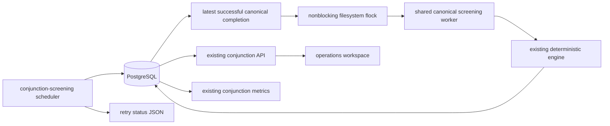

# v0.4F.2 — Automated Conjunction Screening

## Scope

This development adds automatic execution for the existing deterministic
canonical conjunction-screening pipeline. It does not change canonical
ephemeris selection, SGP4 propagation, candidate generation, numerical
refinement, encounter continuity, deduplication, shared-solution suppression,
event provenance, the globe, or CesiumJS.

The automatic path uses the same `run_screening()` function and persisted
`ConjunctionRun`/`ConjunctionEvent` model as the manual CLI. Existing
conjunction metrics and API/UI queries therefore observe automatic runs in the
same way as manual runs.

## Architecture and cadence

The Compose service `conjunction-screening` runs:

```text
python -m workers.conjunction.run_screening_scheduler
```



Defaults are:

- cadence: 14,400 seconds (4 hours);
- screening horizon: 6 hours;
- propagation grid step: 60 seconds;
- scheduler poll ceiling: 60 seconds.

The six-hour horizon and four-hour completion-to-completion cadence provide a
nominal two-hour overlap. Because cadence starts at the persisted
`completed_at`, the effective overlap is reduced by screening execution time.
This keeps future coverage current while preserving all existing screening
mathematics and chunk settings.

The normal deadline is exactly:

```text
latest successful canonical completed_at + interval
```

PostgreSQL is authoritative. The repository selects the latest run whose
`source` is `canonical`, ordered by completion time and run ID. A recent manual
run postpones the scheduler. Missing scheduler state or a container restart
does not make an otherwise recent DB run due. Equality at the deadline is due;
a time strictly before it is not due. If no successful canonical run exists,
the first run is due.

A completion timestamp in the future is not executed. The worker emits a
structured clock-skew warning and continues bounded polling rather than
entering a hot loop.

## Shared execution and lock

The manual command remains:

```bash
python -m workers.conjunction.run_screening
```

Both entry points use the reusable function in that module. The automatic
caller supplies the configured horizon, step, and UTC start time. The shared
function retains the authoritative manual defaults of 10 km candidate distance
and 16 km/s coarse relative-speed bound, always selects `source="canonical"`,
creates a normal SQLAlchemy session, and calls the existing persistence
service.

Both entry points hold a nonblocking `flock` for the entire screening at:

```text
data/observability/conjunction-screening.lock
```

Compose maps it to `/app/data/observability/conjunction-screening.lock` through
the shared `/app/data` bind mount. Scheduler contention is a skipped cycle;
manual CLI contention prints a clear message and exits nonzero. The context
manager releases the lock after success and exceptions. The backend image runs
as UID/GID `10001:10001`; no broad permission changes are required or made.

This is a single-host filesystem lock. It is not a distributed lock and does
not coordinate independent hosts that do not share a filesystem and lock
domain.

## Retry and persistent scheduler state

An actual scheduler execution failure increments `consecutive_failures` and
uses:

```text
retry_initial * retry_multiplier ** (consecutive_failures - 1)
```

The default sequence is 900, 1800, 3600 seconds, then remains capped at 3600.
The scheduler checks `next_retry_at` on every poll and does not retry early. A
successful automatic run resets failures. A successful manual canonical run
whose completion is newer than the scheduler error also clears retry state and
returns to normal DB-derived cadence.

Only retry and process status are stored in:

```text
data/observability/conjunction-screening-status.json
```

The fields include `running`, start/completion timestamps, last status/error,
last run ID, consecutive failures, next retry, and update time. Writes use a
temporary file, `fsync`, and atomic `os.replace`. Missing, partial, legacy, or
invalid JSON is tolerated. Internal error text is not added to an API. The DB
remains the authority for the latest successful screening.

## Configuration

| Variable | Default | Constraint |
| --- | ---: | --- |
| `ORBITAL_CONJUNCTION_SCREENING_INTERVAL_SECONDS` | `14400` | positive integer |
| `ORBITAL_CONJUNCTION_SCREENING_POLL_SECONDS` | `60` | positive; no greater than interval |
| `ORBITAL_CONJUNCTION_SCREENING_RETRY_INITIAL_SECONDS` | `900` | positive integer |
| `ORBITAL_CONJUNCTION_SCREENING_RETRY_MAX_SECONDS` | `3600` | at least retry initial |
| `ORBITAL_CONJUNCTION_SCREENING_RETRY_MULTIPLIER` | `2` | integer at least 2 |
| `ORBITAL_CONJUNCTION_SCREENING_HOURS` | `6` | positive integer hours |
| `ORBITAL_CONJUNCTION_SCREENING_STEP_SECONDS` | `60` | positive; no greater than horizon |

The automatic service reuses these existing engine guardrails without reducing
them:

- `ORBITAL_SCREENING_MAX_OBJECTS=40000`;
- `ORBITAL_SCREENING_MAX_PROPAGATIONS=12000000`;
- `ORBITAL_SCREENING_CHUNK_SECONDS=900`;
- `ORBITAL_SCREENING_MAX_CHUNK_UNIQUE_CANDIDATES=4000000`.

Invalid scheduler values fail during startup. There is no silent fallback.

## Process lifecycle and logs

The scheduler imports without starting work. It handles SIGTERM and SIGINT by
setting an event that interrupts its bounded wait. A recoverable screening
error is recorded and the long-running process continues to its retry. Logs are
structured JSON for startup configuration, changed next-due deadlines, start,
completion, failure, lock contention, clock skew, and shutdown. It does not log
an unchanged not-due result every poll.

`--once` evaluates normal cadence once:

```bash
python -m workers.conjunction.run_screening_scheduler --once
```

It runs only when due and never means force. The manual worker is the explicit
operator path.

## Compose and operations

The service uses the backend image, has no published port or screening
healthcheck, waits for `migrate`, connects to the `app` and internal `data`
networks, mounts `/app/data`, and uses `restart: unless-stopped`. It has no
frontend dependency and does not alter `catalog-sync`.

From `deploy/compose`, inspect configuration and status with:

```bash
docker compose --env-file ../../.env -f compose.core.yml -f compose.observability.yml config --quiet
docker compose --env-file ../../.env -f compose.core.yml -f compose.observability.yml ps conjunction-screening
docker compose --env-file ../../.env -f compose.core.yml -f compose.observability.yml logs --since 10m conjunction-screening
```

Before starting or recreating the service, inspect the latest canonical run:

```bash
curl -fsS http://127.0.0.1:8008/conjunctions/runs/latest
```

Starting an overdue scheduler intentionally starts a real screening. Do not use
`--once` as a read-only status command when the DB run is overdue.

## UI and metrics

Automatic success persists through the existing service, so it updates the
existing latest-run API and the conjunction operation counters, last attempt,
last success, duration, object/event counts, and age metrics. The operations UI
uses the persisted run window and leaves its stale state after a current run.
No second result model or metric family is introduced.

## Validated workload and guardrails

Manual canonical Run ID 26 is the current full-workload reference:

- start: `2026-09-20T18:08:20.212189+00:00`;
- horizon: 6 hours;
- objects: 29,534;
- samples: 361;
- screening duration: 970,491 ms;
- propagation attempts: 10,612,293;
- propagation failures: 0;
- maximum chunk-unique candidates: 2,631,505 of the 4,000,000 guardrail;
- events: 79,898.

This run validates the heavy pipeline. Scheduler tests use fake runners and do
not repeat catalog-scale propagation.

## Troubleshooting

### A run starts at service startup

Compare the latest canonical `completed_at` with the configured interval. A
restart suppresses work only while that DB completion remains recent. An
overdue run is expected to start.

### Lock contention

Inspect both the automatic service and any manual worker. Do not delete the
lock file to bypass an active `flock`; the file's presence alone does not mean
the kernel lock is held.

### Repeated failure

Inspect structured failure type and `next_retry_at` in the internal state file,
then check DB connectivity, catalog freshness, and existing screening
guardrails. Do not lower safety limits merely to make retry succeed.

### Permission error

Verify ownership of the exact `data/observability` directory and container UID
before applying a targeted ownership or ACL repair. Do not use `chmod 777`.

### Clock-skew warning

Correct the host/database clock. A future DB completion is deliberately held
until its completion-plus-interval deadline and is polled at the configured
bounded cadence.
